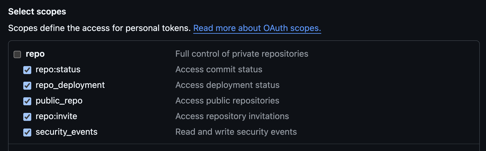

# Contributing to Privateer

We'd love to accept your patches and contributions to this project. There are just a few small guidelines you need to follow.

## Code of Conduct

Participation in this project comes under the [Contributor Covenant Code of Conduct](./CODE_OF_CONDUCT.md)

## Local Development

While working on tests, the best way to run the plugin is via `go run . debug --service=<your-service>`. Ensure your local `config` file is set up correctly beforehand.

You may also pull the code locally and run the local Dockerfile:

1. Pull the repo
2. Modify `example-config.yml` to use your values, and rename it to `config.yml`
3. Build the Docker Image: `make docker-build`
4. Run the Docker Image: `make docker-run`
5. Review the output in the directory you've specified in your config file

## Required Token Scopes

## Code Submission

Thank you for considering submitting code to Privateer!

- We follow the [GitHub Pull Request Model](https://help.github.com/articles/about-pull-requests/) for all contributions.
- All submissions, including submissions by project members, will require review before being merged.
- Please write a [good Git Commit message](https://chris.beams.io/posts/git-commit/)
- Please follow the code formatting instructions below

## Forking

If you come from another language, such as Python, imports behave a bit differently in Go projects than you may be familiar with.

Please review [this guide](https://blog.sgmansfield.com/2016/06/working-with-forks-in-go/) for suggestions on how to successfully develop on a forked branch.

One key to remember: only use `go get` once! The rest of the time you should use two remotes: one to pull code from the primary repo, and another to push code to your fork.

## Formatting

When submitting pull requests, make sure to do the following:

- Format all Go code with `gofmt`. Many people use `goimports` which fixes import statements and formats code in the same style of `gofmt`.
- Remove trailing whitespace. Many editors will do this automatically.
- Ensure any new files have a trailing newline

## Continuous Integration

Privateer uses Github Actions for all CI tasks. You may review the existing workflows in `.github/workflows`. Results of checks will automatically be pushed to PRs and may block merging if checks fail.
